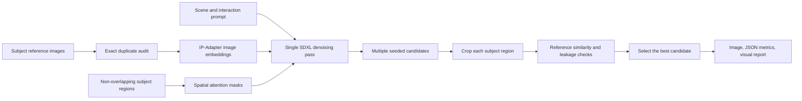

# Multi-Subject Image Customization

Generate one coherent SDXL image from multiple subject reference images and a
scene prompt while keeping each identity inside its intended spatial region.

The optimized pipeline uses masked IP-Adapter conditioning, region-aware CLIP
evaluation, and multi-candidate selection. Subject LoRAs remain available as an
optional experiment, but they are no longer required for the default workflow.

## Why the Original Fusion Failed

The legacy implementation had several structural problems:

1. The background prompt generated a cat and a cup before identity injection,
   so the later inpainting passes often created duplicate subjects.
2. Two large rectangular masks covered almost the entire canvas. After a
   30-pixel blur, each subject could influence the other subject's area.
3. QA compared the full image with a short text prompt. It never compared a
   subject crop with that subject's reference images.
4. `MAX_RETRIES` was configured but never used.
5. The cat training set contained five files but only two unique images, which
   made the LoRA more likely to overfit a small number of poses.
6. The project used Colab-only absolute paths and silently ignored LoRA loading
   errors, making failures difficult to diagnose.

Increasing guidance scale or inpainting strength cannot reliably fix these
issues. The generation and evaluation architecture must isolate identities
spatially and use reference-aware quality signals.

## Optimized Architecture



The important change is that all subjects are composed in one denoising pass.
This preserves shared lighting and perspective. Each reference image is paired
with a spatial mask so its visual features do not spread across the entire
canvas.

## Features

- Masked IP-Adapter Plus conditioning for multiple reference subjects
- Non-overlapping normalized layout regions
- Automatic exact-duplicate detection for reference datasets
- Region-level identity similarity instead of global text-only QA
- Competing-subject similarity to detect identity bleeding
- Multi-seed candidate generation and automatic best-candidate selection
- Portable paths for local machines, Colab, and Linux GPU servers
- Optional, safer DreamBooth LoRA training command
- JSON metrics and visual subject-crop reports
- Unit tests and GitHub Actions

## Requirements

- Python 3.10 or newer
- CUDA-capable NVIDIA GPU recommended
- 16 GB VRAM minimum for conservative settings
- 24 GB or more VRAM recommended for 1024 × 1024 generation
- Approximately 20 GB of free disk space for SDXL, IP-Adapter, CLIP, and caches

CPU and Apple Silicon execution are supported. A 768 × 768 quality-oriented
Apple M3 run is documented below; 1024 × 1024 generation will be substantially
slower and can exceed the unified-memory budget of a 16 GB machine.

## Installation

```bash
git clone https://github.com/ShirinZheng/Multi-Subject-Image-Customization.git
cd Multi-Subject-Image-Customization

python -m venv .venv
source .venv/bin/activate
python -m pip install --upgrade pip
pip install -r requirements.txt
```

The first run downloads the configured SDXL, IP-Adapter, image encoder, VAE,
and CLIP checkpoints from Hugging Face.

## Quick Start

```bash
python examples/run_demo.py
```

Generated artifacts:

- `output/improved_result.png`: selected image
- `output/improved_result.json`: candidate and subject-level scores
- `output/generation_report.png`: layout, final image, and identity crops

## Validated Apple Silicon Result

The full pipeline was validated on an Apple M3 with 16 GB unified memory using
the MPS backend, 768 × 768 output, 28 inference steps, and three candidates.
The selected Seed 42 candidate scored `73.0284` and contains both spatially
isolated subjects with coherent lighting and contact shadows.


Committed validation artifacts:

- [`output/high_quality_768.png`](output/high_quality_768.png): selected image;
- [`output/high_quality_768.json`](output/high_quality_768.json): all three
  candidate scores and subject-level metrics;
- [`output/generation_report.png`](output/generation_report.png): spatial masks,
  selected candidate, and subject crops.

See [`docs/MPS_RUN.md`](docs/MPS_RUN.md) for the exact command, setup notes, and
memory guidance used for the validated run.

Use a custom interaction prompt:

```bash
python examples/run_demo.py \
  --prompt "The same gray tabby cat gently touches the red cup with one paw on a sunlit kitchen table" \
  --seed 120 \
  --candidates 4
```

## Configure Different Subjects

Edit `Config.SUBJECTS` in `src/config.py`. Each subject needs:

- a unique name;
- a natural-language class and description;
- a directory containing reference images;
- a non-overlapping normalized region `(left, top, right, bottom)`;
- an IP-Adapter scale, usually between `0.65` and `0.85`.

Example:

```python
SubjectConfig(
    name="subject_a",
    class_name="golden retriever",
    description="the same adult golden retriever with a blue collar",
    reference_dir=PROJECT_ROOT / "data" / "subject_a",
    region=(0.05, 0.20, 0.52, 0.92),
    adapter_scale=0.80,
)
```

Keep a visible gap between regions. Overlapping regions are rejected because
they are a common source of identity bleeding.

## Reference Image Guidelines

Use 8 to 15 unique images per subject when possible:

- include front, three-quarter, and side views;
- vary distance and background while keeping identity consistent;
- avoid watermarks, UI overlays, motion blur, and heavy filters;
- avoid multiple target subjects in the same reference image;
- do not duplicate files to make the dataset appear larger.

The default pipeline needs at least two unique images per subject because one is
used for conditioning and all unique images are used for evaluation. See
[`docs/DATA_GUIDE.md`](docs/DATA_GUIDE.md) for the full checklist.

## Quality Scores

For every candidate and subject, the pipeline records:

- `identity_similarity`: CLIP image similarity between the generated crop and
  that subject's reference images;
- `prompt_alignment`: similarity between the crop and the subject description;
- `competing_similarity`: similarity to the other subjects' references;
- `leakage_penalty`: penalty when a competing identity is too close to the
  intended identity;
- `composite`: weighted subject score used for candidate selection.

These values are relative ranking signals, not universal quality guarantees.
Always inspect the selected image and subject crops, especially for faces,
logos, exact text, or safety-critical content.

## Optional LoRA Training

Masked IP-Adapter generation works without custom LoRAs. If you want to retrain
the experimental LoRAs, first clone the official Diffusers repository and set
the training script path:

```bash
git clone https://github.com/huggingface/diffusers.git ../diffusers
export DIFFUSERS_TRAIN_SCRIPT="$PWD/../diffusers/examples/dreambooth/train_dreambooth_lora_sdxl.py"

python -c "from src.trainer import run_training; run_training(force=True)"
```

The trainer removes exact duplicates in a temporary curated directory and runs
the official script without shell interpolation. The default generation path
does not activate multiple global LoRAs, because doing so can reintroduce
cross-subject identity bleeding.

## Experiments

Compare vanilla SDXL with the optimized pipeline:

```bash
python experiments/run_baseline_comparison.py
```

Compare unmasked single-sample generation with masked candidate selection:

```bash
python experiments/run_ablation.py
```

## Tests

Install lightweight development dependencies and run:

```bash
pip install -r requirements-dev.txt
pytest
```

The unit suite does not download SDXL or require a GPU. Full image generation is
intentionally kept as a manual GPU validation because model downloads and
inference are too expensive for a normal CI runner.

## Project Structure

```text
Multi-Subject-Image-Customization/
├── data/                         # Reference images
├── docs/                         # Architecture and data guidance
│   └── MPS_RUN.md                # Reproducible Apple Silicon validation
├── examples/
│   └── run_demo.py               # Main command-line entry point
├── experiments/
│   ├── run_ablation.py
│   └── run_baseline_comparison.py
├── src/
│   ├── config.py                 # Models, subjects, regions, and parameters
│   ├── data_quality.py           # Duplicate and dataset validation
│   ├── evaluation.py             # Region-aware CLIP evaluation
│   ├── multi_subject_pipeline.py # Masked generation and candidate selection
│   ├── spatial_layout.py         # Validated layout masks
│   ├── trainer.py                # Optional LoRA training
│   └── visualization.py          # Visual quality report
├── tests/                        # CPU-only unit tests
├── requirements.txt
└── requirements-dev.txt
```

## Known Limitations

- CLIP similarity is useful for ranking but may miss subtle identity details.
- A single reference image is used for IP-Adapter conditioning in the current
  default; all unique references contribute to evaluation.
- Exact text, hands, small accessories, and fine facial details may still need
  manual review or a specialized identity model.
- More subjects require smaller spatial regions and more VRAM.
- The legacy LoRA checkpoints were removed because they were trained from a
  duplicated, very small dataset. Retraining still requires more unique views.

## Technical References

- [Hugging Face Diffusers: IP-Adapter](https://huggingface.co/docs/diffusers/main/using-diffusers/ip_adapter)
- [Hugging Face Diffusers: Loading adapters](https://huggingface.co/docs/diffusers/main/using-diffusers/loading_adapters)
- [Hugging Face Diffusers: DreamBooth](https://huggingface.co/docs/diffusers/main/training/dreambooth)
- [Hugging Face Transformers: CLIP](https://huggingface.co/docs/transformers/model_doc/clip)
- [IP-Adapter paper](https://arxiv.org/abs/2308.06721)
- [MS-Diffusion paper](https://arxiv.org/abs/2406.07209)

## License

This project is released under the MIT License.
